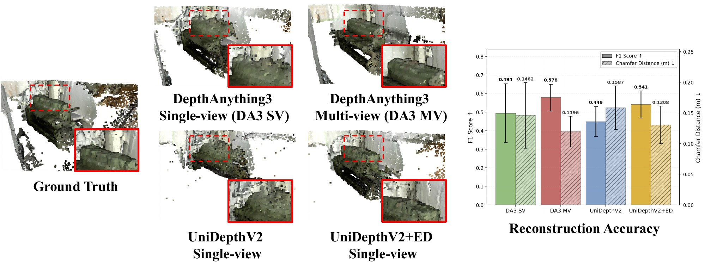

<div align="center">

# Geometric Distillation from Rectified Stereo:<br>Leveraging Epipolar Cues for Monocular Depth

**ECCV 2026**

[Jung-Hee Kim](https://jungheekim29.github.io/)<sup>1</sup> &nbsp;&nbsp; [Xiaoming Liu](https://www.cse.msu.edu/~liuxm/)<sup>1,2</sup>

<sup>1</sup>Michigan State University &nbsp;&nbsp; <sup>2</sup>University of North Carolina at Chapel Hill

[](https://jungheekim29.github.io/EpiDistill/)
[](https://arxiv.org/abs/2607.15600)

</div>

---

> ### 🚧 Code is coming very soon
>
> The inference and evaluation release for **EpiDistill** is being finalized and will be pushed
> to this repository shortly. Watch or star the repository to be notified.

---

<div align="center">
  
</div>

EpiDistill transfers the scale-aware geometric priors of multi-view models into monocular depth
foundation models, so a single-view model retains epipolar attention patterns and metric scale
without requiring multi-view inputs at inference.

See the [project page](https://jungheekim29.github.io/EpiDistill/) for results and qualitative
comparisons.

## Citation

```bibtex
@inproceedings{kim2026epidistill,
  title     = {Geometric Distillation from Rectified Stereo:
               Leveraging Epipolar Cues for Monocular Depth},
  author    = {Kim, Jung-Hee and Liu, Xiaoming},
  booktitle = {European Conference on Computer Vision (ECCV)},
  year      = {2026},
  eprint    = {2607.15600},
  archivePrefix = {arXiv}
}
```
